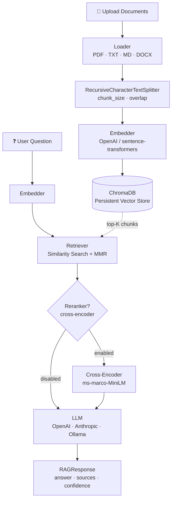

# RAG Q&A System

> A production-ready Retrieval-Augmented Generation system for document Q&A — built from scratch, no LangChain.

Upload your documents, ask natural-language questions, and get answers that are grounded in your content — with source citations and confidence scores.

---

## Architecture



---

## Features

| Feature | Detail |
|---|---|
| Multi-format ingestion | PDF (PyMuPDF), TXT, Markdown, DOCX |
| Recursive chunking | Custom `RecursiveCharacterTextSplitter` — no LangChain |
| Dual embedding backends | OpenAI `text-embedding-3-small` or local `sentence-transformers` |
| Diverse retrieval | MMR (Maximal Marginal Relevance) to reduce redundancy |
| Optional reranking | Cross-encoder (`ms-marco-MiniLM-L-6-v2`) for precision boost |
| Multi-LLM support | OpenAI, Anthropic, and local Ollama |
| REST API | FastAPI with full CRUD and Pydantic v2 schemas |
| Chat UI | Streamlit — chat history, settings sidebar, collapsible sources |
| Docker-ready | Multi-stage Dockerfile + docker-compose for one-command startup |
| Test suite | pytest with mocked embedder/LLM — no API keys required |
| CI | GitHub Actions — lint, type-check, test on every push |

---

## Quick Start (Docker)

```bash
git clone https://github.com/vivek-kommareddy/rag-qa-system.git
cd rag-qa-system
cp .env.example .env
# Edit .env — set at least one LLM provider key (OpenAI, Anthropic, or Ollama)
make docker-up
```

| Service | URL |
|---|---|
| FastAPI API | http://localhost:8000 |
| Swagger docs | http://localhost:8000/docs |
| Streamlit UI | http://localhost:8501 |

---

## Local Development

```bash
# 1. Clone and create a virtual environment (Python 3.11+ required)
git clone https://github.com/vivek-kommareddy/rag-qa-system.git
cd rag-qa-system
python3.11 -m venv .venv && source .venv/bin/activate

# 2. Install dependencies
make install

# 3. Configure environment
cp .env.example .env
# Edit .env — at minimum set LLM_PROVIDER and the matching API key

# 4. (Optional) Seed sample documents
make seed

# 5. Run API + UI concurrently
make dev
```

---

## API Reference

### `POST /upload`

Upload one or more documents for indexing.

**Request:** `multipart/form-data` with field `files` (repeatable).

**Response:**
```json
{
  "doc_ids": ["3fa85f64-..."],
  "total_chunks": 42
}
```

---

### `POST /ask`

Ask a question against indexed documents.

**Request:**
```json
{ "question": "What is the company's PTO policy?" }
```

**Response:**
```json
{
  "answer": "Employees receive 15 days of PTO per year ...",
  "confidence_score": 0.87,
  "latency_ms": 1240.5,
  "sources": [
    {
      "doc_id": "3fa85f64-...",
      "filename": "company_handbook.md",
      "page_number": null,
      "chunk_index": 7,
      "content_snippet": "Employees receive 15 days of PTO ..."
    }
  ]
}
```

---

### `GET /documents`

List all indexed documents.

**Response:**
```json
{
  "documents": [
    { "doc_id": "3fa85f64-...", "filename": "handbook.md", "num_chunks": 42 }
  ]
}
```

---

### `DELETE /documents/{doc_id}`

Remove a document and all its chunks from the vector store.

**Response:**
```json
{ "status": "deleted", "doc_id": "3fa85f64-..." }
```

---

### `GET /health`

```json
{ "status": "ok", "doc_count": 3, "vector_store_size": 126 }
```

---

## Configuration

Copy `.env.example` to `.env` and fill in the values.

| Variable | Description | Default |
|---|---|---|
| `OPENAI_API_KEY` | OpenAI API key (required for OpenAI provider) | — |
| `ANTHROPIC_API_KEY` | Anthropic API key (required for Anthropic provider) | — |
| `LLM_PROVIDER` | `openai` \| `anthropic` \| `ollama` | `openai` |
| `LLM_MODEL` | Model name for generation | `gpt-3.5-turbo` |
| `EMBEDDING_MODEL` | `text-embedding-3-small` or a sentence-transformers model ID | `text-embedding-3-small` |
| `CHROMA_PERSIST_DIR` | Directory where ChromaDB persists data | `chroma_data` |
| `CHUNK_SIZE` | Max characters per chunk | `512` |
| `CHUNK_OVERLAP` | Overlap characters between chunks | `50` |
| `TOP_K` | Number of chunks to retrieve | `5` |
| `RERANK_ENABLED` | Enable cross-encoder reranking | `false` |

---

## Evaluation

`scripts/evaluate.py` runs 10 question–answer pairs against the sample documents and reports three metrics:

| Metric | Description |
|---|---|
| **Answer Relevance** | Cosine similarity between question and answer embeddings |
| **Faithfulness** | % of answer sentences traceable to a retrieved source chunk |
| **Retrieval Precision** | % of retrieved chunks relevant to the question |

```bash
make seed        # index sample docs first
python scripts/evaluate.py
```

---

## Tech Stack

| Component | Technology |
|---|---|
| Language | Python 3.11 |
| API | FastAPI + Uvicorn |
| UI | Streamlit |
| Vector DB | ChromaDB |
| Embeddings | OpenAI `text-embedding-3-small` / `sentence-transformers` |
| LLM | OpenAI / Anthropic / Ollama |
| Reranking | `cross-encoder/ms-marco-MiniLM-L-6-v2` |
| Templating | Jinja2 |
| Testing | pytest + pytest-cov |
| Linting | ruff + mypy |
| Container | Docker (multi-stage) + docker-compose |
| CI | GitHub Actions |

---

## Project Structure

```
rag-qa-system/
├── README.md
├── LICENSE
├── .gitignore
├── .env.example
├── docker-compose.yml
├── Dockerfile               # multi-stage, non-root user, health check
├── Makefile
├── requirements.txt
├── setup.py
├── pyproject.toml
├── docs/
│   ├── architecture.md
│   └── images/
│       └── architecture_diagram.png
├── src/
│   ├── __init__.py
│   ├── config.py            # pydantic-settings BaseSettings
│   ├── ingestion/
│   │   ├── loader.py        # PDF, TXT, MD, DOCX → Document dataclass
│   │   ├── chunker.py       # RecursiveCharacterTextSplitter (no LangChain)
│   │   └── embedder.py      # OpenAI v1 / sentence-transformers
│   ├── vectorstore/
│   │   ├── base.py          # Abstract VectorStore interface
│   │   └── chroma_store.py  # ChromaDB with cosine similarity + delete by doc_id
│   ├── retrieval/
│   │   ├── retriever.py     # Similarity search + MMR
│   │   └── reranker.py      # Cross-encoder reranking (optional)
│   ├── generation/
│   │   ├── llm.py           # OpenAI / Anthropic / Ollama wrappers (current SDKs)
│   │   ├── prompt_templates.py
│   │   └── chain.py         # Full RAG pipeline → RAGResponse
│   ├── api/
│   │   ├── main.py          # FastAPI app with lifespan handler
│   │   ├── routes.py        # /upload /ask /documents /health
│   │   ├── schemas.py       # Pydantic v2 models
│   │   └── middleware.py    # Request logging + global exception handler
│   └── ui/
│       └── streamlit_app.py # Chat UI with session state and source expanders
├── tests/
│   ├── conftest.py          # MockEmbedder, MockVectorStore, api_client fixture
│   ├── test_chunker.py
│   ├── test_retriever.py
│   ├── test_chain.py
│   └── test_api.py
├── scripts/
│   ├── seed_data.py         # Ingest sample docs into ChromaDB
│   └── evaluate.py          # Relevance / faithfulness / precision metrics
└── data/
    └── sample_docs/
        ├── ai_research_paper.txt
        ├── company_handbook.md
        └── product_faq.txt
```

---

## Makefile Targets

```bash
make install     # pip install -r requirements.txt
make dev         # run API (port 8000) + Streamlit UI (port 8501) locally
make test        # pytest --cov=src --cov-report=term-missing
make lint        # ruff check . && mypy src/
make docker-up   # docker-compose up --build
make seed        # python scripts/seed_data.py
```

---

## Contributing

1. Fork the repository and create a feature branch.
2. Run `make lint` and `make test` — both must pass before opening a PR.
3. Maintain at least 85% test coverage (`make test` will report it).
4. Open a pull request describing the change and its motivation.

---

## License

MIT — see [LICENSE](LICENSE).
