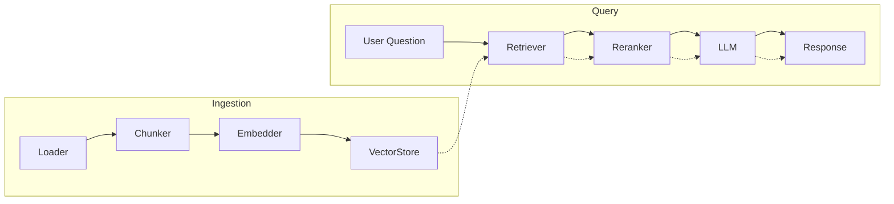

# Architecture

This document describes the high‑level architecture of the Retrieval‑Augmented Generation (RAG) system implemented in this repository.  The system follows a modular design, separating ingestion, vector storage, retrieval, reranking and generation into their own components.  It exposes both a REST API and a Streamlit UI for users to interact with.

## Overview

Users upload documents through the API or UI.  Each document is loaded into memory, split into overlapping chunks and embedded into a high‑dimensional vector space.  The embeddings along with metadata are stored persistently in a ChromaDB collection.  When a question is asked, the system retrieves the most similar chunks using maximum marginal relevance (MMR) and optionally reranks them with a cross‑encoder.  Finally, a language model generates an answer conditioned on the retrieved chunks.

## Component Diagram

### Components

* **Loader** – Reads files of various formats (PDF, TXT, Markdown, DOCX) and produces a list of `Document` objects containing text and metadata.
* **Chunker** – Splits each document into overlapping chunks using a recursive algorithm that tries to cut on paragraph and sentence boundaries.  Each chunk carries forward the metadata of its parent document along with a chunk index.
* **Embedder** – Converts each text chunk into a vector embedding.  The model used is configurable and can be either a remote API (OpenAI) or a local sentence‑transformers model.
* **VectorStore** – Stores embeddings and metadata in a persistent ChromaDB collection.  Supports similarity search and metadata filtering.
* **Retriever** – Performs a similarity search against the vector store for a given query.  The top results can be diversified using maximum marginal relevance (MMR).
* **Reranker** – (Optional) Uses a cross‑encoder model to rerank the candidate chunks for improved relevance.  Only used if enabled via configuration.
* **LLM** – A wrapper over various language model providers (OpenAI, Anthropic, Ollama).  Given a user question and context from retrieved chunks, it produces a grounded answer.

### API Layer

The FastAPI layer defines endpoints to upload documents, ask questions, list documents, delete documents and check health.  It initializes the vector store on startup and orchestrates the ingestion and retrieval pipeline for each request.  Middleware handles CORS and logging.

### User Interface

A simple Streamlit application provides a chat‑like interface to upload documents, configure retrieval parameters and ask questions.  The UI consumes the REST API and displays answers along with collapsible source citations.